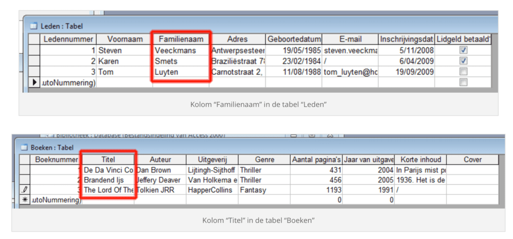

Elke tabel bestaat uit <strong>twee of meerdere kolommen</strong> of velden. Deze komen overeen met de informatie die we willen bijhouden van onze tabellen. Bijvoorbeeld de titel en de auteur van een boek.

In de kolom “Familienaam” vinden we vervolgens elke familienaam van elk lid.

