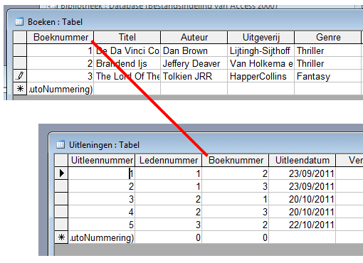
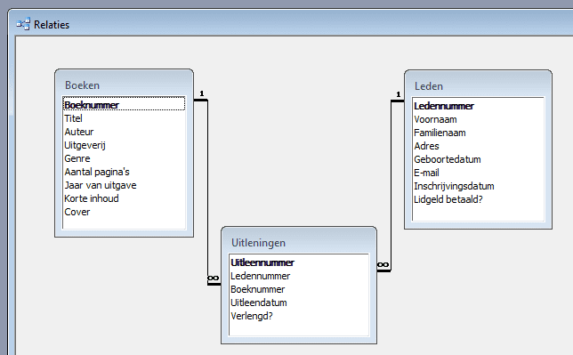

<strong>Tussen</strong> de <strong>verschillende tabellen</strong> kunnen er <strong>relaties</strong> bestaan. We kunnen dit uitleggen aan de hand van een voorbeeld:

In de database “Bibliotheek” hebben we de tabel “Uitleningen”. Hierin vinden we volgende informatie:

* Uitleennummer (de primaire sleutel)
* Ledennummer (deze verwijst naar een lid in de tabel “Leden” die dit ledennummer heeft)
* Boeknummer (deze verwijst naar een boek in de tabel “Boeken” die dit boeknummer heeft)
* Uitleendatum
* Verlengd?
* Inleverdatum

Tussen de tabellen ontstaat er dus een relatie. De tabel “Uitleningen” verwijst met “Ledennummer” en “Boeknummer” naar respectievelijk de tabel “Leden” en “Boeken”.

