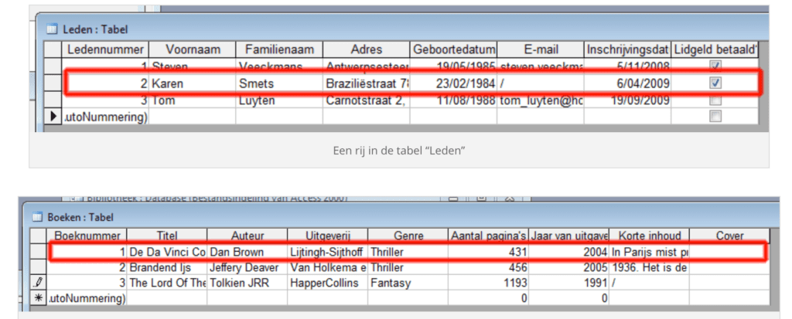

In een tabel komen gegevens te staan. Alle gegevens van één boek vormen een <strong>rij of record</strong>. Een lege tabel, m.a.w. zonder gegevens, bevat logischerwijs geen records. Als er in de tabel “Boeken” 16 boeken staan, bevat deze 16 records of rijen.

