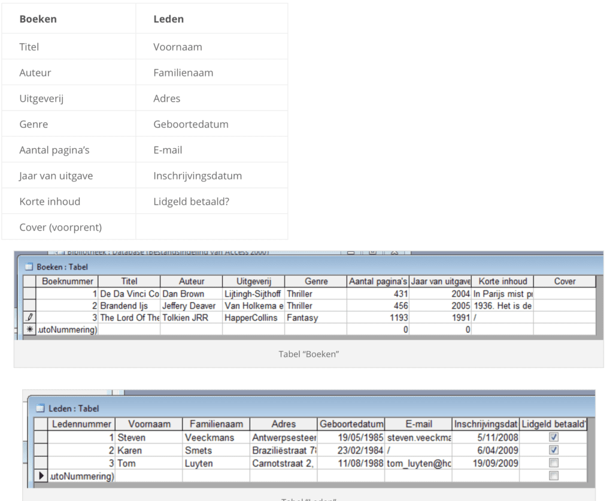
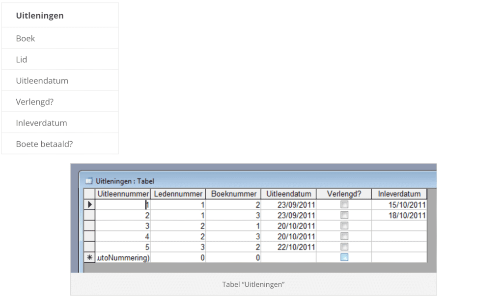

De gegevens van een bibliotheek kunnen we opsplitsten in verschillende onderdelen: de boeken en de leden. Zo een onderdeel wordt in een database een tabel genoemd. Zo krijgen we een tabel “Boeken” en een tabel “Leden”. Per tabel wordt er specifieke informatie bijhouden.

Wanneer nu een lid van de bibliotheek een boek uitleent, dient ook deze informatie bijgehouden te worden. Hiervoor maken we in de database een derde tabel “Uitlengingen”.

