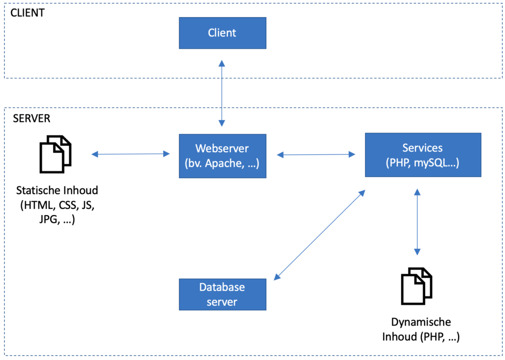

In de client-server architectuur is de client de partij die een vraag stelt, de server is de partij die daarop antwoord.

Het werk dat een server heeft met het beantwoorden van de vraag is afhankelijk van het type vraag.

Afhankelijk van de taak zijn er verschillende client programma’s die kunnen worden gebruikt. Afhankelijk van de taak worden ook verschillende types server aangesproken.

## Opvragen van inhoud via de browser
Een webbrowser (= client) kan enkel HTML informatie ontvangen en tonen. Om dynamische inhoud te tonen is een <strong>webserver</strong> noodzakelijk die deze HTML kan opbouwen. 

De gevens worden doorgaans in een database bewaard. De webserver communiceert daarvoor dus met een <strong>databaseserver</strong>.

De CSS/JS, beelden en andere documenten die bij een aanvraag van dynamische inhoud horen worden wel nog steeds statisch aangeboden. De webserver functioneert dan enkel als doorgeeflijk. De inhoud kan bijvoorbeeld wel nog afgeschermd worden wanneer de aanvrager niet de correcte authorisatie heeft.

