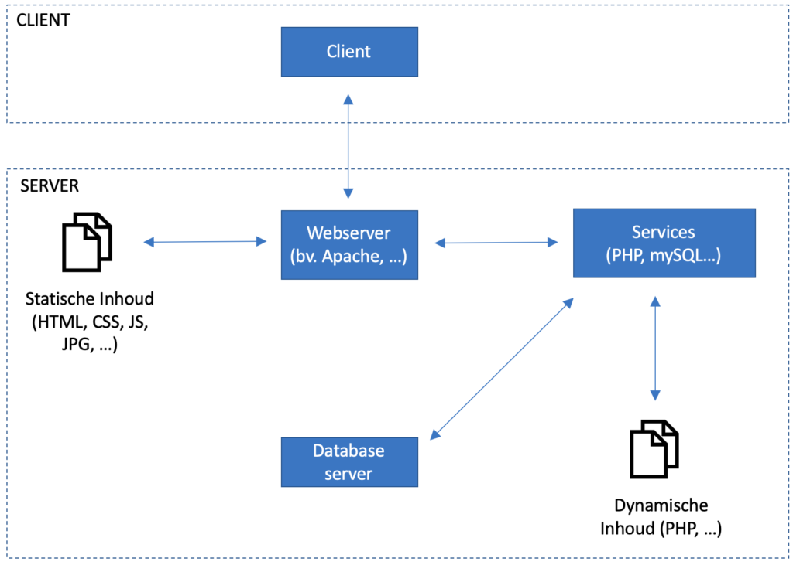
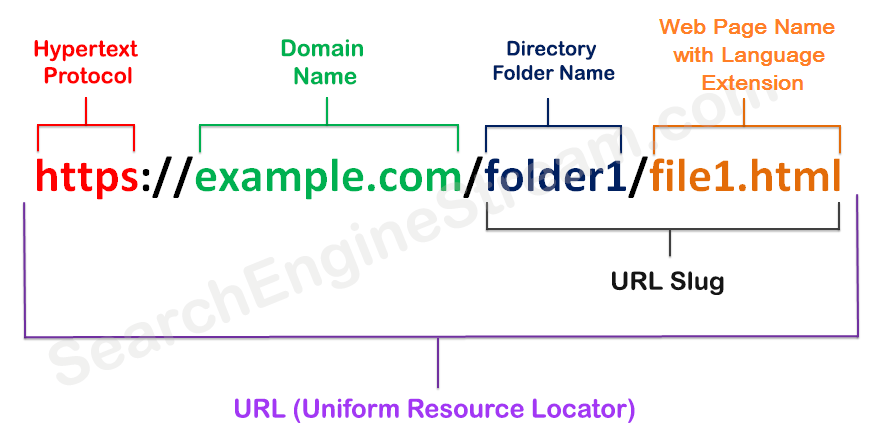
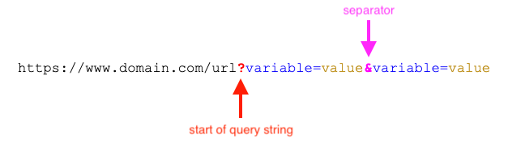

Een vraag via de webbrowser gebeurt via het HTTP protocol. Dat staat voor <strong>Hypertext Transfer Protocol</strong>.
  
Een webbrowser is het doorgeefluik van tekstuele informatie. Dat kan bijvoorbeeld HTML zijn of de inhoud van een beeld of document.

Om de dynamische inhoud te bouwen wordt een script, bijvoorbeeld via <strong>PHP</strong>, uitgevoerd dat textuele informatie oplevert waarmee de webserver kan werken.

De gegevens worden doorgaans in een database bewaard. De communicatie met de <strong>databaseserver</strong> gebeurt ook via dat zelfde script.

### De aanvraag 

Aan de hand van de URL weet de webserver welk bestand of script wordt opgevraagd en welke services nodig zijn om het resultaat te verkrijgen dat moet worden terug gestuurd.

#### De (unieke) URL

<ul>
  <li>het protocol: http(s)</li>
  <li>de domeinnaam die achterliggend verwijst naar een IP adres (elke publieke server heeft een publiek IP adres) en een plekje op de server waar de bestanden staan</li>
  <li>de folder binnen het gereserveerde plekje op de server</li>
  <li>het bestand in de folder</li>
</ul>

In het beeld hierboven is het opgevraagd bestand een HTML bestand, statische inhoud dus. Daarvoor is geen verwerking op de server nodig. Als dit een PHP bestand zou zijn weet de webserver dat de PHP service moet worden gestart om de dynamische inhoud te bouwen.

Wanneer geen bestand is opgegeven in de URL wordt gezocht naar <code>index.html</code> of <code>index.php</code> om op te vragen.

#### De URL parameters

Bij een URL aanvraag kunnen extra parameters verstuurd worden die voor, bijvoorbeeld, PHP nuttig zijn bij het verwerken van de informatie.

Die parameter kan bijvoorbeeld een ID zijn (een unieke waarde / sleutel) om in een database de juiste gegevens op te halen, of een parameter die bijvoorbeeld aangeeft of een overzicht van gegevens oplopend of aflopend moet worden gesorteerd.

De parameters zijn dus belangrijk om het resultaat van de HTTP aanvraag te bepalen.

Enkel voorbeelden, kijk goed naar het verschil in resultaat:
* <a href="https://www.google.be/" target="_blank">https://www.google.be/</a>
* <a href="https://www.google.be/imghp" target="_blank">https://www.google.be/imghp
* <a href="https://www.google.be/?q=url%20parameters" target="_blank">https://www.google.be/?q=url%20parameters</a>
* <a href="https://www.google.be/?query=url%20parameters" target="_blank">https://www.google.be/?query=url%20parameters</a>
* <a href="https://www.google.be/search?q=url%20parameters" target="_blank">https://www.google.be/search?q=url%20parameters</a>
* <a href="https://www.google.be/search?as_q=url%20parameters&tbm=isch" target="_blank">https://www.google.be/search?as_q=url%20parameters&tbm=isch</a>
* <a href="https://www.google.be/search?query=url%20parameters&lr=lang_zh-CN" target="_blank">https://www.google.be/search?query=url%20parameters&lr=lang_zh-CN</a>
* <a href="https://www.google.be/search?query=url%20parameters&lr=lang_zh-CN&hl=zh-CN" target="_blank">https://www.google.be/search?query=url%20parameters&lr=lang_zh-CN&hl=zh-CN</a>

Zoals je ziet is de naamgeven van een parameter soms betekenisvol, soms niet. Het belangrijkste is dat het ontvangende script ze "begrijpt". Als ze ook belangrijk zijn voor <strong>SEO</strong> (<strong>S</strong>earch <strong>E</strong>ngine <strong>O</strong>ptimisation) dan zijn ze natuurlijk wel best betekenisvol.

#### De verborgen parameters of informatie
Naast de parameters via de URL kunnen er ook (nog) parameters of informatie verborgen worden verstuurd. Dat is vooral interessant als de inhoud die moet worden verstuurd uitgebreid is (bv. bij het versturen van een formulier) of gevoelig is (bv. een paswoord).

#### De aanvraag methode

Een URL aanvraag gaat ook gepaard met een methode. De belangrijkste zijn:
* <strong>GET</strong>: Opvragen van informatie (standaard via een webbrowser)
* <strong>POST</strong>: Versturen van informatie (bijvoorbeeld via de submit knop van een formulier)
* PUT: Bijwerken van (bestaande) informatie (bijvoorbeeld op basis van een URL parameter)
* DELETE: Verwijderen van (bestaande) informatie (bijvoorbeeld op basis van een URL parameter)
* ...

### Het resultaat

#### De inhoud

Het resultaat van een aanvraag is (meestal) de opgevraagde inhoud. Meestal, want er kan natuurlijk ook vanalles fout lopen.

De inhoud kan het HTML resultaat zijn, maar evengoed de inhoud van een Javascript, een CSS bestand of de inhoud van een beeld of Excel document.

#### Het inhoud type

Naast de inhoud komt ook altijd een inhoud type mee. Op die manier kan de client het antwoord op de correcte manier weer geven. 

#### De code

Het resultaat van een aanvraag komt naast de inhoud ook altijd met een <strong>code</strong>. Deze weerspiegelt of de server de vraag correct heeft kunnen afhandelen of dat er een probleem is opgetreden.

De meest courante codes:
* <strong>200</strong>: Alles OK
* <strong>404</strong>: Het opgevraagde bestand of script werd niet gevonden
* 403: Niet voldoende rechten (bijvoorbeeld omdat met de vraag niet de correcte authorisatie gegevens zijn mee gestuurd).
* <strong>500</strong>: Intere server fout (meestal door PHP code die niet correct kon worden uitgevoerd)

### Dynamische informatie in combinatie met statische informatie

Het CSS bestand, het JavaScript bestand, de beelden en eventuele andere documenten die bij een aanvraag van dynamische informat horen worden wel nog steeds statisch aangeboden. 

De webserver functioneert dan enkel als doorgeeflijk. De inhoud kan bijvoorbeeld wel nog afgeschermd worden wanneer de aanvrager niet de correcte authorisatie heeft.

Het opvragen van élk bestand of script gebeurt via een aparte HTTP aanvraag.  

Op die manier kan de HTML van een pagina perfect in orde zijn (code 200), maar een beeld in die pagina niet getoond worden omdat de locatie niet correct is (code 404).

