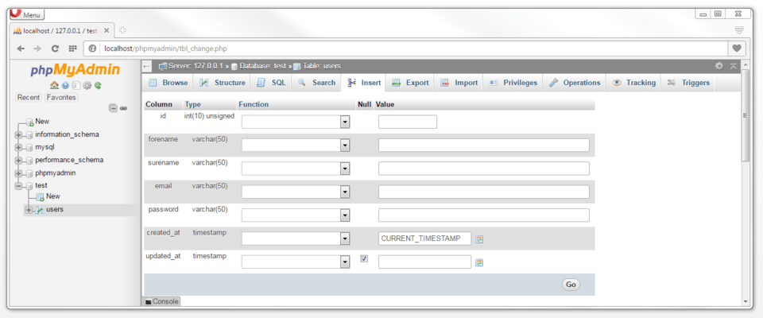
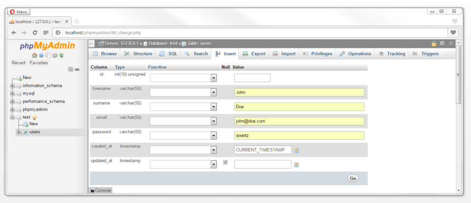
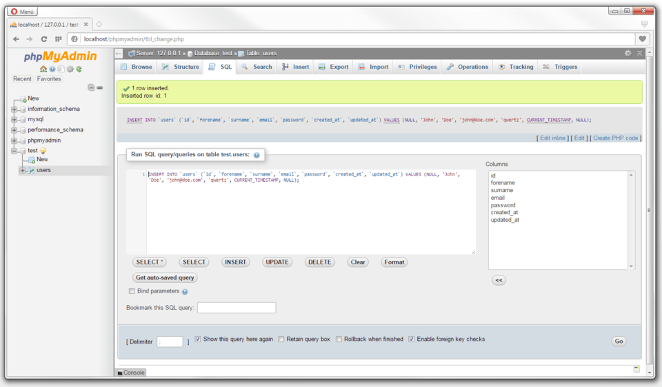
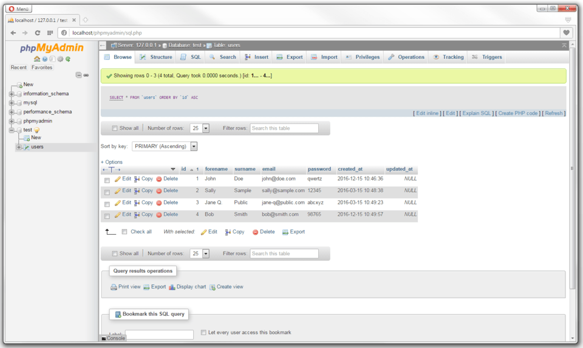

##Rijen toevoegen
Rijen invoegen doe je via de “insert” tab:

Bij “value” voorzie je de waarde. Je ziet via “type” welke type inhoud wordt verwacht.

Wanneer je een A_I (auto increment) veld hebt voorzien moet je daar geen waarde invoeren. Dat wordt automatisch voorzien bij het opslaan.

via “Go” onderaan voeg je de rij definitief toe
Je ziet nu ook wel SQL commando is uitgevoerd:

<pre>
INSERT INTO users (id, forename, surname, email, password, 
		created_at, updated_at) VALUES (NULL, 'John', 'Doe', 'john@doe.com',
		'qwerty', CURRENT_TIMESTAMP, NULL);
</pre>

##Rijen bewerken, verwijderen of dupliceren
Via de “Browse” tab zie je alle rijen van de tabel.

Je kan een rij bewerken of verwijderen via de “Edit” knop vooraan.

##Rijen sorteren
Via de “Browse” tab zie je alle rijen van de tabel. Je kan op een eigenschap klikken om de rijen te sorteren (oplopend of aflopend).