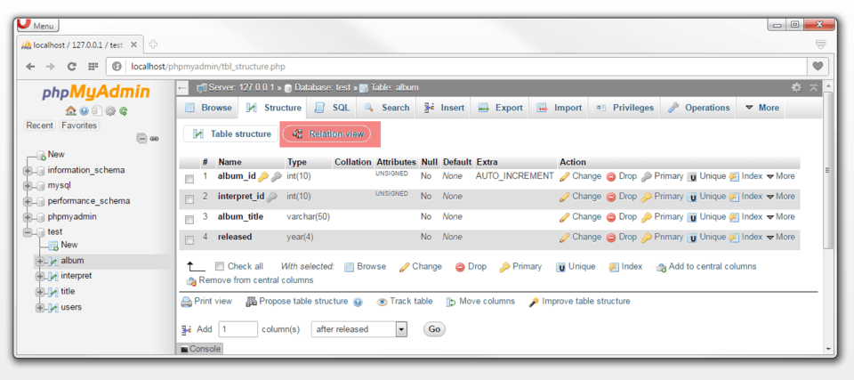

## Geen SELECT zonder correcte primaire en secundaire sleutels
De indexen definieer je de parameters INDEX, UNIQUE en A_I. Je herkent ze in PHPMyAdmin aan het gele en grijze sleuteltje.

Je kan ook de relaties bepalen via de “Structuur” tab en dan de knop “Relatieoverzicht”.

## Simpele SELECT
Een simpele <strong>SELECT-query</strong> bestaat bijvoorbeeld uit de volgende componenten:

<pre>
SELECT kolom_naam (,...) FROM tabel_naam;
</pre>

Eerst specificeer je het SQL-commando SELECT en vervolgens geef je aan op welke <strong>kolommen</strong> en <strong>tabellen</strong> het commando van toepassing is. Een puntkomma sluit het statement af.

Voorbeeld:

<pre>
SELECT Voornaam, Achternaam FROM Auteurs;
</pre>

## Een SELECT met voorwaarde

<pre>
SELECT kolom_naam (,...) FROM tabel WHERE voorwaarde;
</pre>

De voorwaarde bestaat uit 3 onderdelen:

* de kolom_naam
* de operator (=, <, >, <=, >=, LIKE)
* de waarde: tussen ‘-accenten
 
Verschillende voorwaardes kunnen met AND en OR zijn.

Voorbeelden:
<pre>
SELECT Voornaam, Achternaam FROM Auteurs WHERE Geboorteplaats='Cambridge';
SELECT Voornaam, Achternaam FROM Auteurs WHERE Geboorteplaats LIKE '%bridge%';
SELECT Voornaam, Achternaam FROM Auteurs WHERE Geboortejaar >= '1973';
SELECT Voornaam, Achternaam FROM Auteurs WHERE Geboortejaar >= '1970' AND Geboortejaar <= '1980';
</pre>

### Een SELECT met sortering
<pre>
SELECT kolom_naam (,...) FROM tabel WHERE voorwaarde ORDER BY sorteervolgorde_kolom_naam;
</pre>

## Een SELECT met relaties
### klassieke relatie

<pre>
SELECT tabel_1.kolom_naam (,...) FROM tabel_1, tabel_2 WHERE tabel_1.kolom_primaire_id = tabel_2.kolom_secundaire_id;
</pre>

### Inner join
De tabel “Auteurs” en “Werken” worden gerelateerd via de het index veld auteur_id en de overeenkomstige rijen worden getoond in het resultaat.

<pre>
SELECT * FROM Auteurs INNER JOIN Werken ON Auteurs.auteur_id = Werken.auteur_id;
</pre>

De tabel “Auteurs”, “Werken” en “Uitgeverij” worden gerelateerd via de het index veld auteur_id en uitgeverij_id en de overeenkomstige rijen worden getoond in het resultaat.

<pre>
SELECT * FROM Auteurs INNER JOIN Werken ON Auteurs.auteur_id = Werken.auteur_id INNER JOIN Uitgeverij ON Werken.uitgeverij_id = Uitgeverij.uitgeverij_id;
</pre>

### Left join
Alle rijen van de link tabel “Werken” worden getoond, als er geen relatie met rechtse tabel “Uitgeverij” wordt gevonden worden de resultaten met NULL opgevuld.

<pre>
SELECT * FROM Werken LEFT JOIN Uitgeverij ON Werken.uitgeverij_id = Uitgeverij.uitgeverij_id;
</pre>
<table class="table"><thead><tr><th>werk_id</th><th>auteur_id</th><th>uitgeverij_id</th><th>Titel</th><th>Eerste publicatie</th><th>uitgeverij_id</th><th>Naam</th></tr></thead><tbody><tr><td>1</td><td>1</td><td>1</td><td>In de Ban van de Ring</td><td>1954</td><td>1</td><td>Uitgeverij Unieboek-Het Spectrum</td></tr><tr><td>2</td><td>1</td><td>2</td><td>De Hobbit</td><td>1937</td><td>2</td><td>George Allen &amp; Unwin</td></tr><tr><td>3</td><td>1</td><td><em>NULL</em></td><td>De Silmarillion</td><td>1977</td><td><em>NULL</em></td><td><em>NULL</em></td></tr><tr><td>4</td><td>2</td><td><em>NULL</em></td><td>Het Transgalactisch Liftershandboek</td><td>1979</td><td><em>NULL</em></td><td><em>NULL</em></td></tr><tr><td>5</td><td>2</td><td><em>NULL</em></td><td>Het Restaurant aan het Einde van het Heelal</td><td>1980</td><td><em>NULL</em></td><td><em>NULL</em></td></tr><tr><td>6</td><td>2</td><td><em>NULL</em></td><td>Het Leven, het Heelal en de Rest&nbsp;</td><td>1984</td><td><em>NULL</em></td><td><em>NULL</em></td></tr></tbody></table>

### Right join
Alle rijen van de rechtste tabel “Uitgeverij” worden getoond, als er geen relatie met links tabel “Werken” wordt gevonden worden de resultaten met NULL opgevuld.

<pre>
SELECT * FROM Werken RIGHT JOIN Uitgeverij ON Werken.uitgeverij_id = Uitgeverij.uitgeverij_id;
</pre>
<table class="table"><thead><tr><th>werk_id</th><th>auteur_id</th><th>uitgeverij_id</th><th>Titel</th><th>Eerste publicatie</th><th>uitgeverij_id</th><th>Naam</th></tr></thead><tbody><tr><td>1</td><td>1</td><td>1</td><td>In de Ban van de Ring</td><td>1954</td><td>1</td><td>Uitgeverij Unieboek-Het Spectrum</td></tr><tr><td>2</td><td>1</td><td>2</td><td>De Hobbit</td><td>1937</td><td>2</td><td>George Allen &amp; Unwin</td></tr><tr><td><em>NULL</em></td><td><em>NULL</em></td><td><em>NULL</em></td><td><em>NULL</em></td><td><em>NULL</em></td><td>3</td><td>Cosmos</td></tr></tbody></table>
