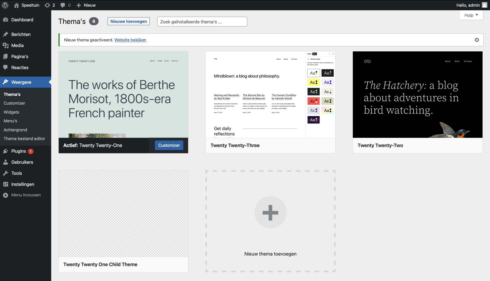
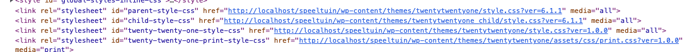

Child theme zijn dé manier om een nieuw thema te bouwen dat toch al alle mogelijkheden van het moeder thema (parent theme) over neemt. Je kan dan naar hartelust CSS en templates gaan aanpassen zonder dus van nul te moeten starten.

Je start door in de folder <code>wp-content/themes</code> een nieuwe folder aan te maken met de interne naam van je thema. Gebruik bij voorkeur <strong>kleine letters en geen spaties</strong>.

## Voorbereiding

### Child theme folder
Binnen onze speeltuin Wordpress website maken we in de <code>wp-content/themes</code> de folder <code>twentywentyone_child</code> aan. Dit wordt dus een kind thema dat het <em>twentytwentyone</em> theme als moeder thema zal krijgen.

### style.css
Binnen die child theme folder voorzie je een een bestand <code>style.css</code>. Dit bestand zal naast eigen CSS ook en vooral belangrijke informatie bevatten over het child theme.

### functions.php
Binnen die child theme folder voorzie je ook een een bestand <code>functions.php</code>. Dit bestand zal ervoor zorgen dat het child theme gaat werken en de functies kunnen worden uitgebreid

## style.css: meer dan eigen CSS
Zoals gezegd bevast de style.css naast de eigen CSS code ook een stukje commentaar bovenaan dat wat instellingen van het thema bepaalt. Het is belangrijk dat dit stukje correct geschreven is. Dus in het formaat zoals hieronder aangegeven.

<pre>
/*
Theme Name:   Twenty Twenty One Child Theme
Description:  A Twenty Twenty-One child theme 
Template:     twentytwentyone
Version:      1.0.0
*/

.eigen-css-hier {
}
</pre>

Hierboven hebben we de minimale instellingen gezet die het thema nodig heeft om binnen Wordpress geregistreerd te geraken. 
De <code>template</code> installing verwijst naar het moeder thema.

Het theme verschijnt nu alvast op de thema pagina. Je kan het zelfs als al activeren. Je zal zien dat het 100% werkt zoals het <em>moeder thema</em>. Het thema waarop dit thema is gebouwd.

## functions.php: de aanpassingen doen werken

Zoals gezegd dient het <code>functions.php</code> bestand om de aanpassingen aan het thema ook effectief te doen werken.

### Eigen CSS inladen

Belangrijk voor nu is dat we naast de CSS van het moeder thema ook onze eigen CSS gaan inladen. Dat doen we door een <strong>functie toe te voegen</strong> aan onze <code>functions.php</code>.

<pre>
&lt;?php
function twentytwenty_child_enqueue_styles() {
    // Laad de parent theme CSS.
    wp_enqueue_style( 'parent-style', get_template_directory_uri() . '/style.css' );

    // Laad de child theme CSS.
    wp_enqueue_style( 'child-style', get_stylesheet_directory_uri() . '/style.css' ); 
}

// Voer de functie twentytwenty_child_enqueue_styles uit.
add_action( 'wp_enqueue_scripts', 'twentytwenty_child_enqueue_styles' );
?&gt;
</pre>

