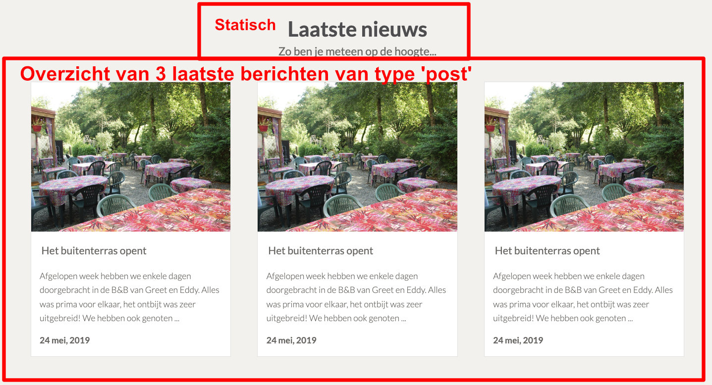
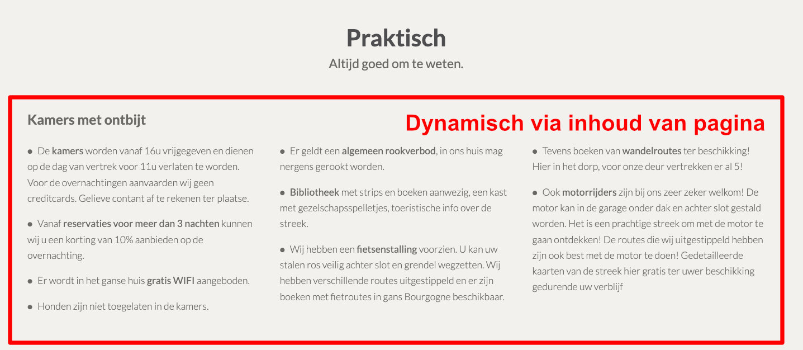
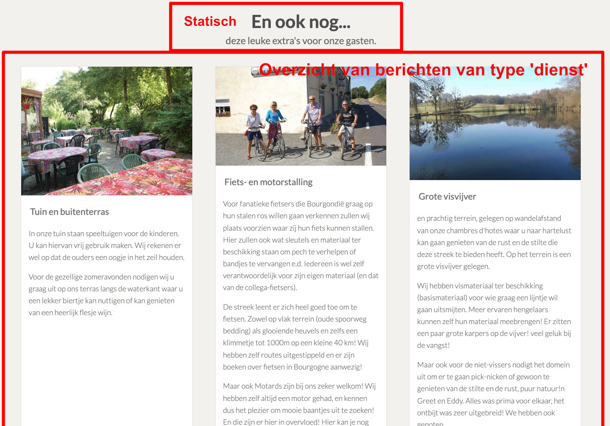

<h3>Vooraf</h3>

De bedoeling van deze eindopdracht is niet om HTML / CSS skills te testen. Wel om te evalueren of je de verschillende Wordpress technieken en PHP kan toepassen om een dynamische website te creëren.
 

Laat daarom zoveel mogelijk zien. Ook al is het resultaat (nog) niet 100%.

De Wordpress integratie kan volledig uitgevoerd worden met de aangeleerde technieken en gebruikte plugin.

Er is een kleine "uitsmijter" voorzien bij het gastenboek waar een extra plugin wordt voorgesteld om de <em>kriebels</em> te tonen nadat ze via het formulier zijn ingevuld. Hou deze uitdaging sowieso voor het laatst.

## Indienen van de opdracht

* Je dient je Wordpress project in, ten laatste <strong>zondag 5 maart 2023 om 23u59</strong>. 

* Je doet door een export te maken van je volledige website via de <a href="https://nl.wordpress.org/plugins/all-in-one-wp-migration/">All-in-one WP Migration</a> plugin. Op de pagina van de plugin staat een instructie video.

* De export levert een <code>.wpress</code> bestand op. Pas de bestandsnaam <strong>NIET</strong> aan. Verstuur deze integraal via <a href="https://www.wetransfer.com">WeTransfer</a> naar <a href="mailto:bert@data-web.be">bert@data-web.be</a>.

## Statische HTML en CSS

De statische HTML/CSS kan je <a href="mdg/mdg.zip">hier</a> downloaden.

De CSS binnen de statische website is al behoorlijk volledig en zo opgebouwd dat hij <em>Wordpress vriendelijk</em> is. 

Je mag hem zeker aanpassen. Het is wel een <em>best practice</em> om eventuele aanpassingen onderaan de CSS toe te voegen (bijvoorbeeld onder de <code>/* eigen CSS */</code> comment en de bestaande CSS zoveel mogelijk in tact te houden. Regels onderaan worden namelijk als laatste uitgevoerd en passen zo eerdere CSS instellingen aan.

De beste garantie op een zo mooi mogelijk resultaat is door de structuur van de statische webpagina's zoveel mogelijk te behouden als je deze over neemt in je Wordpress templates.

## Instructies

### Voorbereiding
1. Maak een <code>dmg</code> folder aan in je <code>httpdocs</code> folder op je XAMPP server.
2. Download de statische website via de link hierboven en plaats de inhoud van de ZIP in de <code>dmg/statisch</code> folder. De statische website kan nu bekeken worden in de browser via de URL <a target="_blank" href="http://localhost/mdg/statisch/">http://localhost/mdg/statisch/</a> (localhost kan eventueel moeten worden gewijzigd naar je lokaal IP adres, check daarvoor het XAMPP controle paneel).
3. Zet een Wordpress op in de folder <code>httpdocs/mdg</code> volgens de instructies die je hebt geleerd. De database geef je de naam <strong>mdg</strong>. De Wordpress website zal dus toegankelijk zijn via <a target="_blank" href="http://localhost/mdg/">http://localhost/mdg/</a>.
4. Open de <code>httpdocs/mdg</code> folder als een nieuw project in Visual Studio Code.
5. Je kan nu starten aan je Wordpress integratie. <strong>Succes</strong>.

### Daar gaan we

Zorg voor zo weinig mogelijk dubbele code en hou template bestanden leesbaar. Maak gebruik van <em>template parts</em> waar mogelijk.

 

1. Zet een eigen thema op (vanaf nul, dus <strong>geen child theme</strong>)
2. Voorzie de nodige bestanden binnen het thema om het te herkennen in Wordpress
3. Registreer het logo en de primaire menu (voor boven en beneden).
4. Voorzie de eerste template die altijd verplicht is en zorg voor de header en footer die op elke pagina gaan terug komen. 

### Wederkerende elementen

#### Header

Op elke pagina komt bovenaan een banneer beeld met daarvoor de pagina titel te staan. Op de startpagina is dat banner beeld wat hoger voorzien.

Ook de primary menu en het logo behoren tot de header. Beide zijn beheerbaar via Wordpress en moeten dus dynamisch worden voorzien.

#### Footer

De footer onderaan start vanaf de section "Genieten in bourgogne!". Dat beeld met die slogan mag je statisch behouden.

Verder komt in de footer rechts de primaire navigatie terug.

### Start pagina

### Kamers

### Kamers

