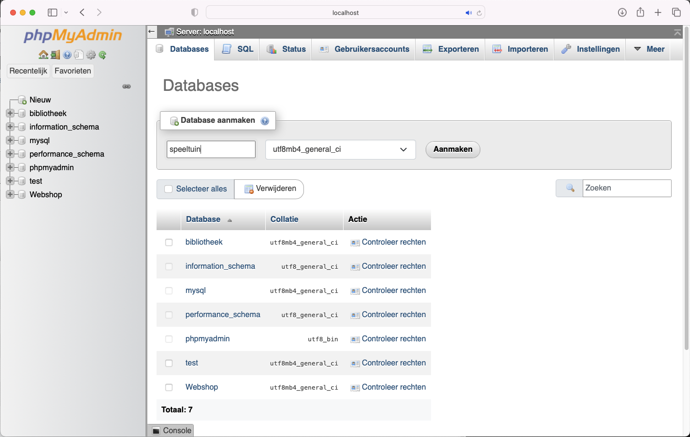
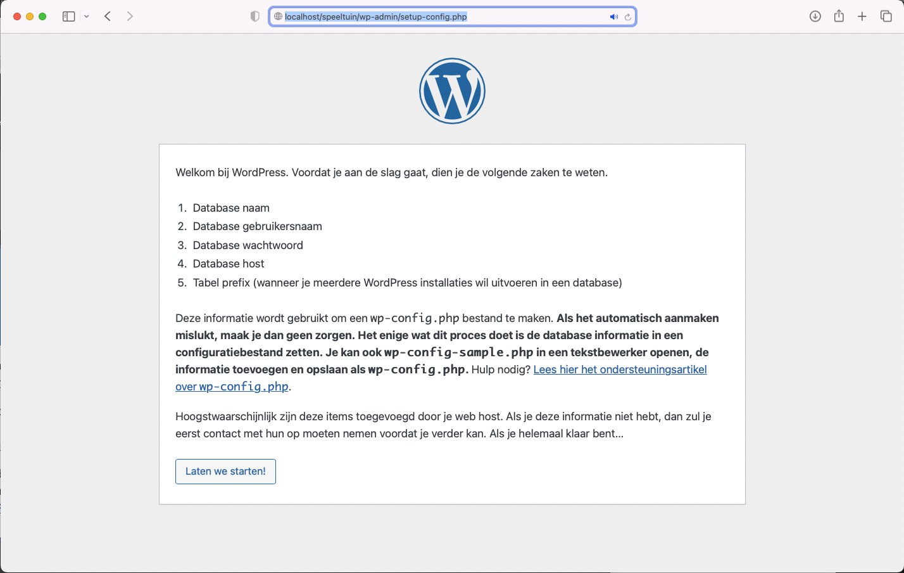
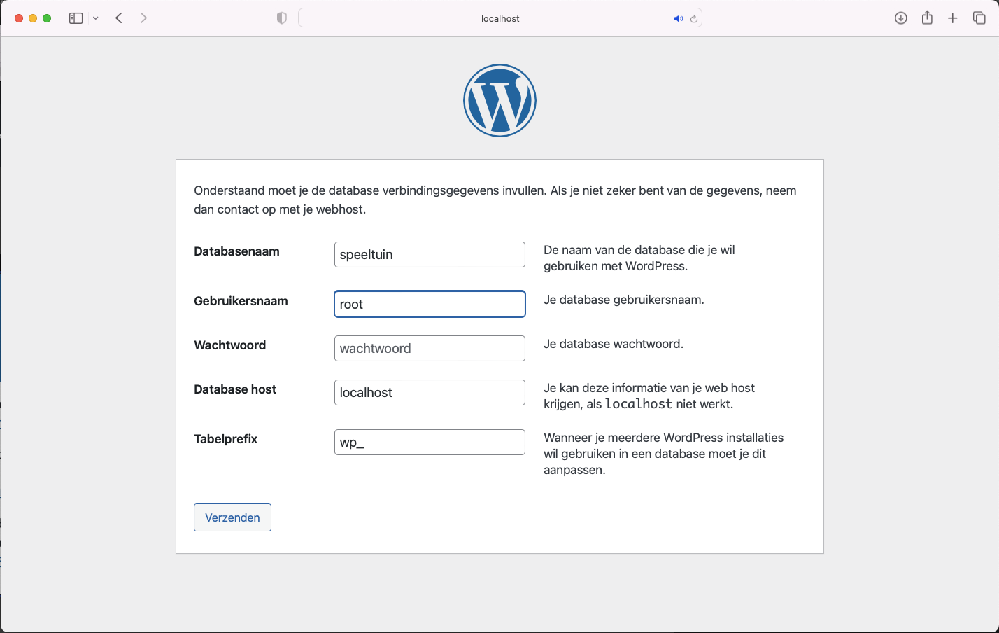
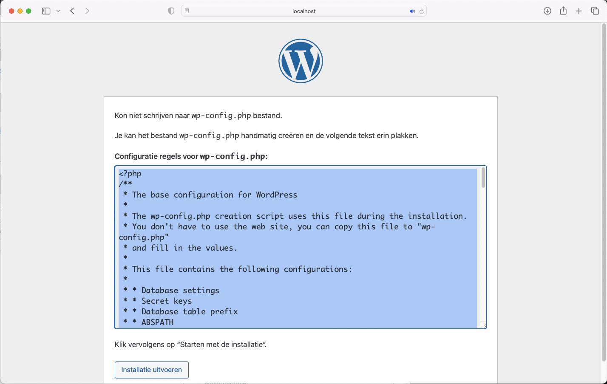
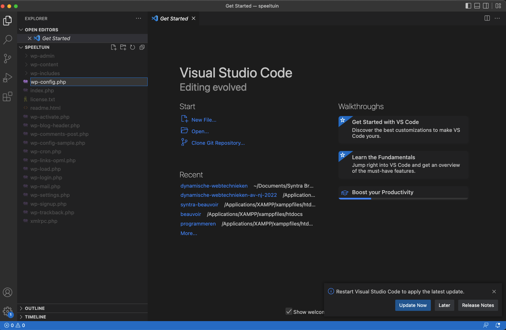
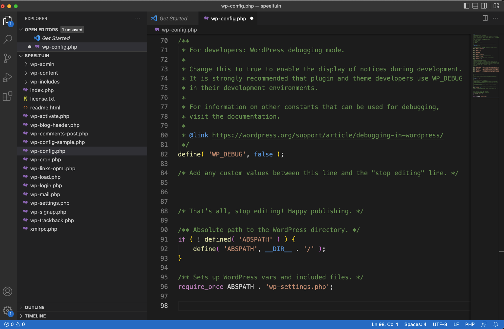
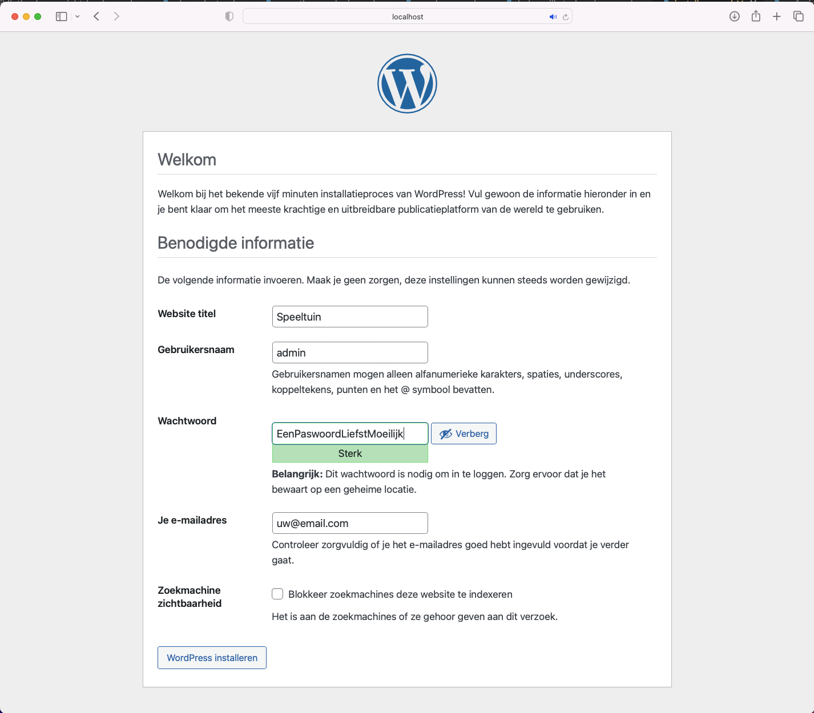

Om Wordpress te gaan gebruiken heb je toegang nodig tot:
* een <strong>webserver die PHP ondersteund</strong> 
* een <strong>database</strong>

Zo'n webserver kan dus op het internet draaien of lokaal via bv. <strong>XAMPP</strong>.

### Database "speeltuin" aanmaken
Surf naar phpMyAdmin (via http://localhost/dashboard/) en maak een database "speeltuin" aan. Tabellen toevoegen hoeft niet.

### Folder <code>speeltuin</code> aanmaken in <code>htdocs</code> folder
In de speeltuin gaan we een Wordpress opzetten waarin je naar hartelust kan experimenteren.

### Folder <code>speeltuin</code> openen in Visual Studio code

### Download Wordpress
Download Wordpress op https://nl-be.wordpress.org/download/, de ZIP bevat de <em>Drupal core</em>

### Inhoud van ZIP naar <code>speeltuin</code> folder
Open de ZIP die werd gedownload en kopieer de inhoud uit de <code>wordpress</code> folder naar een nieuwe folder <code>speeltuin</code> in de <code>htdocs</code> folder.

### Surf naar http://localhost/speeltuin/

### Klik op "Laten we starten"
Vul de database gegevens in (database "speeltuin", gebruikersnaam "root" en geen paswoord)

### Maak wp-config.php aan
Maak het bestand <code>wp-config.php</code> met de inhoud die je in dit scherm kan kopieëren.

### Installatie uitvoeren
Vervolg met de knop "Installatie uitvoeren"

### Website informatie
Geef een website naam en bepaal een gebruikersnaam waarmee je de website gaat beheren.

