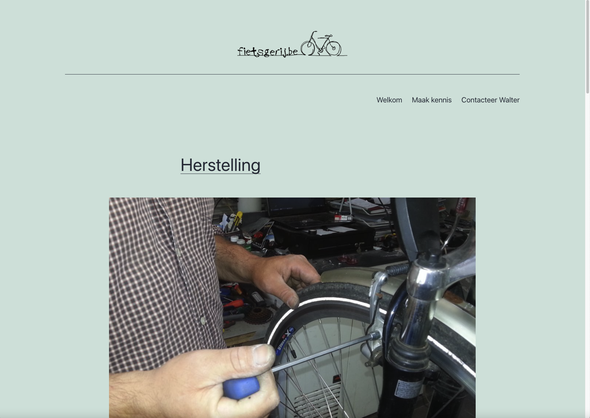
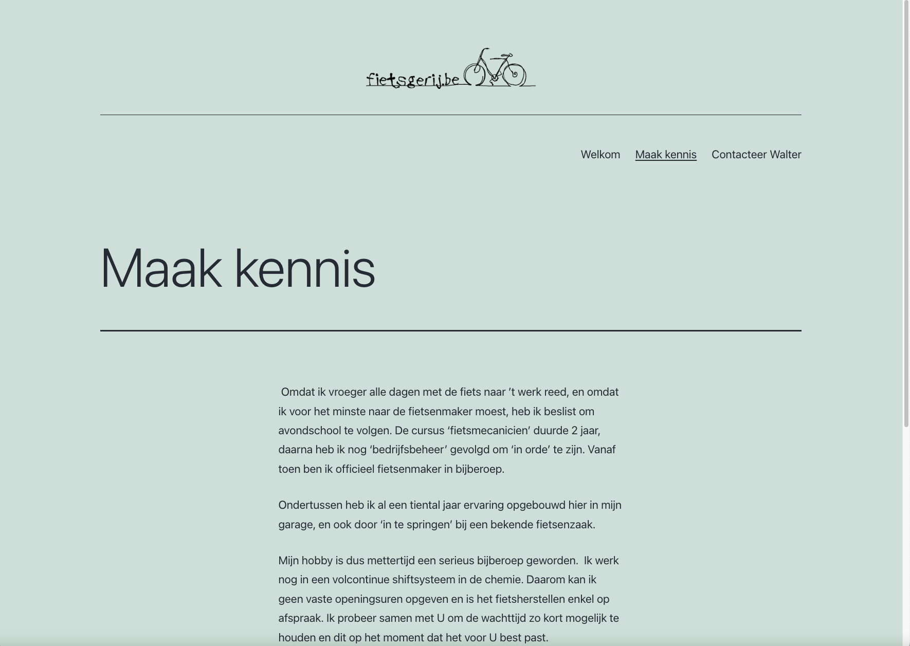
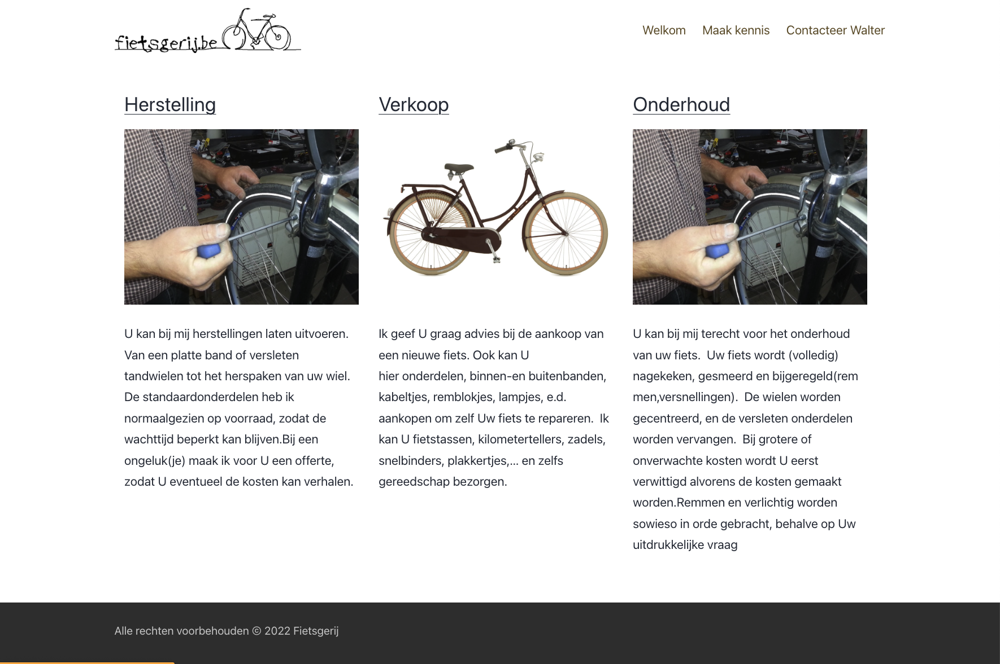
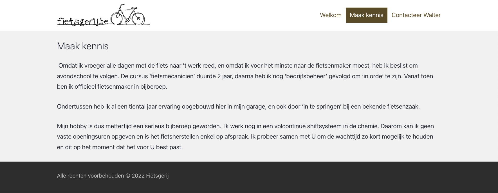

## Voorbereiding: wordpress website "Fietsgerij" opzetten
1. <strong>Maak deze folder aan</strong>: <code>/htdocs/dynamische-webtechnieken-av-nj-2022/wordpress/fietsgerij</code>. Zo komt de folder uiteindelijk ook in GIT terecht (en dus bij mij).
2. Kopieer de inhoud uit de <code>wordpress</code> folder (in je 'downloads' folder) naar de folder die je hebt aangemaakt in stap 1. Vind je de wordpress folder niet meer in je 'downloads' folder dan download je die opnieuw via de wordpress website.
3. Maak een <strong>lege database "fietsgerij"</Strong> aan via PHPMyAdmin (bereikbaar via het dashboard van XAMPP).
4. <strong>download</strong> <a href="fietsgerij/database.sql">deze mysql database</a>
5. <strong>importeer</strong> de database in de aangemaakte datebase in stap 3 <strong>via PHPMyAdmin > "Importeren"</strong> knop bovenaan. 
6. <strong>download</strong> <a href="fietsgerij/wp-config.zip">wp-config.zip</a>
7. Open de zip en <strong>plaats het bestand <code>wp-config.php</code> in de folder</strong> gemaakt in stap 1.
8. <strong>download</strong> <a href="fietsgerij/uploads.zip">uploads.zip</a>.
9. Open de zip en <strong>plaats de inhoud in de folder <code>/htdocs/dynamische-webtechnieken-av-nj-2022/wordpress/fietsgerij/wp-content/uploads</code></strong>.
10. <strong>surf</strong> nu naar http://localhost/dynamische-webtechnieken-av-nj-2022/wordpress/fietsgerij of http://127.0.01/dynamische-webtechnieken-av-nj-2022/wordpress/fietsgerij en de website zou moeten openen.

## Instructies
1. Maak een correct <em>child theme</em> met de naam "twentytwenty_child" gebaseerd op het <code>twentytwentyone</code> thema.
2. Activeer het aangemaakte <em>child theme</em>. De groene achtergrond zou alvast wit moeten worden 😊
2. Schrijf de CSS in style.css van het <em>child theme</em>.

<h3>TIPS</h3>
<ul>
<li>Gebruik de inspectietool, bekijk de huidige CSS en pas die aan via de eigen style.css</li>
<li>De menu items hebbend deze kleur: #66522B. De footer area heeft de achtergrond kleur #333 en voorgrond kleur #CCC.

## Het resultaat

### Voor

### Na

