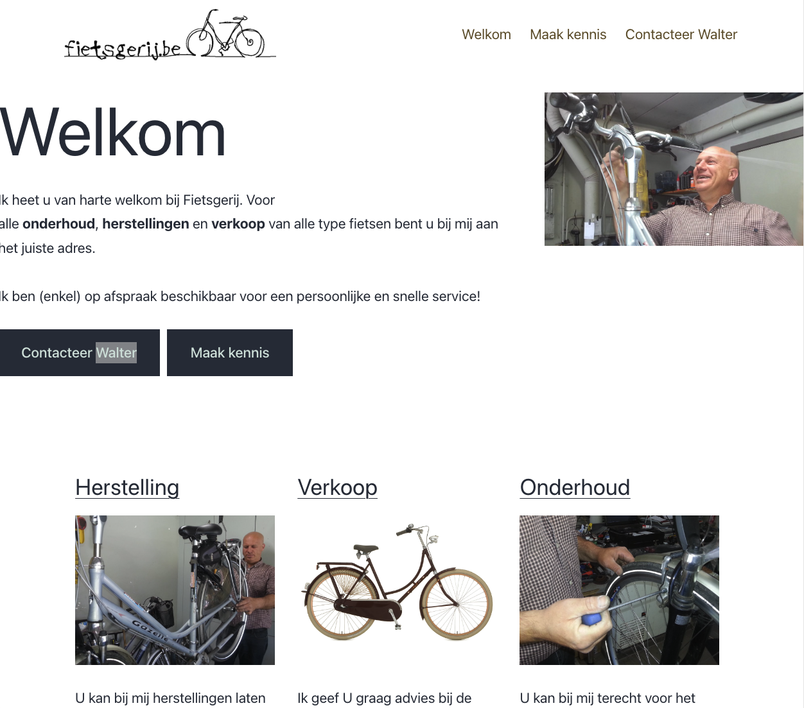
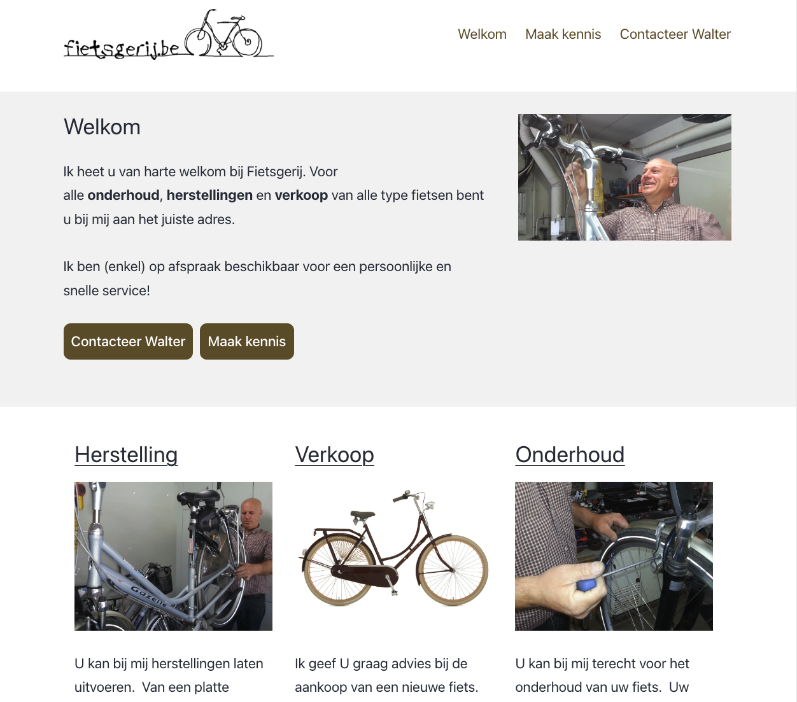

## Voorbereiding
1. Registreer een "top widget" binnen Wordpress.
2. <strong>download</strong> <a href="fietsgerij/templates.zip">de zip</a>
3. plaats het bestand <code>index.php</code> en de <code>template-parts</code> in de <code>twentytwenty_child</code> folder

De widget is nu geregistreerd en wordt getoond in de pagina net onder de hoofding.

## Instructies
1. Voorzie de inhoud voor de widget zone via de Wordpress (via de Gutenberg editor). 
2. Voorzie de CSS zodat het resultaat er uit ziet zoals hieronder. 

### voor
 

### na 
