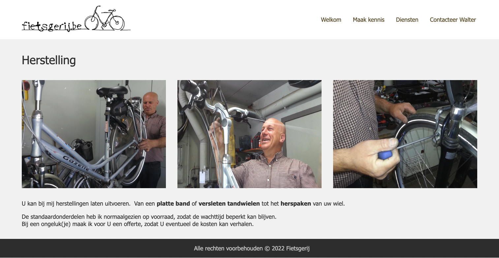

## Instructies

1. Voorzie bij een dienst 3 extra afbeelding velden.
2. Zorg dat de 3 beelden getoond worden op de detail pagina van een diesnt. Ter vervanging van het hoofdbeeld.

Het hoofdbeeld wordt wel nog gebruikt voor de overzichten op de startpagina en de diensten pagina.

